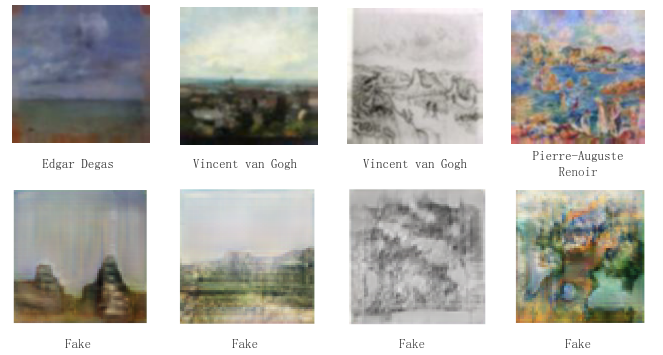
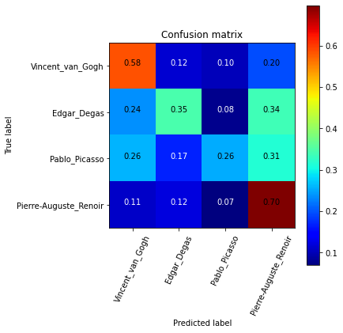

# DL-project

Is this real? True Masterpiece or not.

This is a course project for ECE-7123 Deep Learning of Youwen Zhang (yz6999) and Run Yu (ry2068).


### Project Structure

```
├── data/                  -- data dir
├── src/                   -- scripts for model training, evaluation, and others
|		 ├── GAN.ipynb         -- GAN model training scirpt
|		 ├── Evaluation.ipynb  -- evaluation script for FID
|    └── ResNet50.ipynb    -- ResNet50 training and evaluation script
├── images/                -- results
└── README.md              -- readme
```


### Get Started

1. Download data from [Kaggle Dataset: Best Artworks of All Time](https://www.kaggle.com/ikarus777/best-artworks-of-all-time)

2. Run the `GAN.ipynb` on Kaggle Notebook or Google Colab.

   1. If you use Kaggle Notebook, please change the dir name in the Kaggle format.

   2. If you use Google Colab, please download the dataset to your Google Colab with following instructions (~5mins):

      ```bash
      !pip install kaggle
      !mkdir ~/.kaggle
      !echo '{"username":"","key":""}' >> kaggle.json # kaggle.json from kaggle account API
      
      !cp kaggle.json ~/.kaggle/
      !chmod 600 ~/.kaggle/kaggle.json
      !kaggle datasets download ikarus777/best-artworks-of-all-time
      !unzip -qq best-artworks-of-all-time.zip
      ```

   3. Train GAN models (~4hrs).

   4. Generate fake images (~10mins). 

3. Run the `Evaluation.ipynb` with real and fake images as input to calculate Frechet Inception Distance (FID) scores. 

4. Run the `ResNet50.ipynb` with real images as training set and test set. Then use the trained ResNet50 model to classify the fake images.


### Results

1. Real artworks with generated images:



2. FID calculation:

   ```
   Prepared (10, 128, 128, 3) (10, 128, 128, 3)
   Scaled (10, 299, 299, 3) (10, 299, 299, 3)
   FID (same): -0.000
   FID (different): 12.973
   ```

3. Confusion matrix of ResNet50:

   